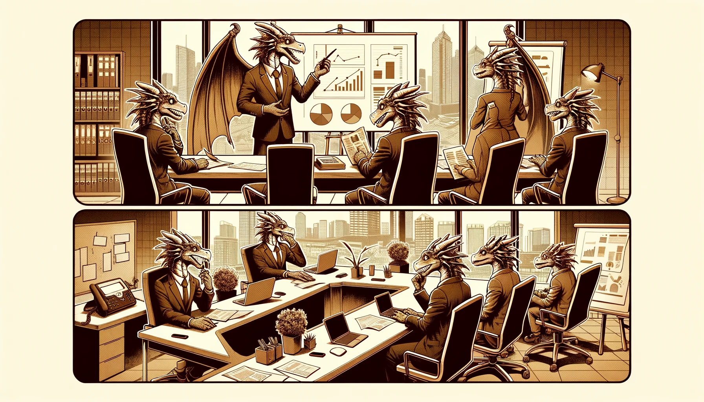

  

# Welcome to the Ethereum Credit Guild

 

We’re a community dedicated to scaling onchain lending and borrowing without trust assumptions.

Credit v1 is launching on Arbitrum this Friday, April 19. Compared to existing lending pools, Credit is:

 
* resilient to market manipulation attacks
* more efficient at liquidity management
* able to support a vastly higher diversity of loan types
* optimized for passive lenders with veto rights and bad debt markdown

## LEND without third party risk
Credit is designed with passive lenders in mind. Market depositors can veto potentially harmful governance changes, or delegatethis power to community representatives. Any bad debt is marked down immediately so that active lenders can’t front run passive depositors. Optimistic governance allows for streamlined operation while reducing trust assumptions.

## BORROW without oracles
Borrow using an unlimited diversity of collateral assets without fearing market manipulation attacks or oracle errors. Say goodbye to fixed5 or 10 percent liquidation penalties thanks to our Dutch Auction model. 

